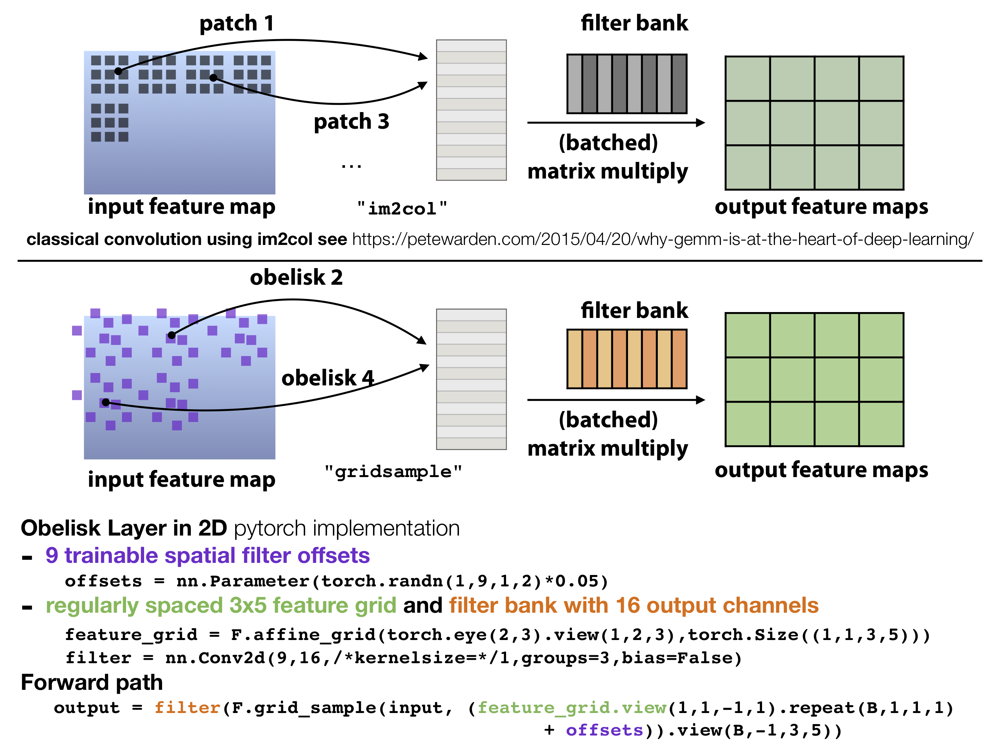
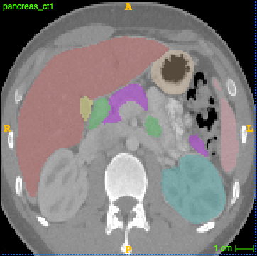

# OBELISK one binary extremely large and inflecting sparse kernel 
(pytorch v1.0 implementation) 

This repository contains code for the Medical Image Anaylsis (MIDL Special Issue) paper:
OBELISK-Net: Fewer Layers to Solve 3D Multi-Organ Segmentation with Sparse Deformable Convolutions
by Mattias P. Heinrich, Ozan Oktay, Nassim Bouteldja 
(winner of the MIDL 2018 best paper award)

The main idea of OBELISK is to learn a large spatially deformable filter kernel for (3D) image analysis. It replaces a conventional (say 5x5) convolution with 1) trainable spatial filter offsets xy(z)-coordinates and 2) a linear 1x1 convolution that contains the filter coefficients (values). During training OBELISK will adapt its receptive field to the given problem in a completely data-driven manner and thus automatically solve many tuning steps that are usually done by 'network engineering'. The OBELISK layers have substantially fewer trainable parameters than conventional CNNs used in 3D U-Nets and perform often better for medical segmentation tasks.

The working principle (and the basis of its implementation) are visualised below. The idea is to replace the im2col operator heavily used in matrix-multiplication based convolution in many DL frameworks with a continuous off-grid grid_sample operator (available for 3D since pytorch v0.4). Please also have a look at https://petewarden.com/2015/04/20/why-gemm-is-at-the-heart-of-deep-learning/ if you're not familiar with im2col. 



You will find many more details in the upcoming MEDIA paper
or for now in the original MIDL version: https://openreview.net/forum?id=BkZu9wooz

How to use this code:
The easiest use-case is to first run the inference on the pre-processed TCIA multi-label data. You need:
- download the raw dicom files with pancreas CTs provided by NIH within the cancer imaging archive: https://wiki.cancerimagingarchive.net/display/Public/Pancreas-CT
- download the multi-label annotations of Eli Gibson from: https://zenodo.org/record/1169361#.XDOEAi2ZM9U
- install c3d http://www.itksnap.org/pmwiki/pmwiki.php?n=Downloads.C3D
- run the provided pre-processing scripts (will be uploaded shortly)
- make sure your conda/pip3 pytorch install is up to date (v1.0) and you have a GPU installed 
- download this repo and run
python 
```
inference.py -dataset tcia -fold 1 -model obeliskhybrid -input pancreas_ct1.nii.gz -output mylabel_ct1.nii.gz
```
Note that the folds are defined as follows: fold 1 has not seen labels/scans #1-#10, fold 2 has not seen labels #11-#22 etc.
- you can now visualise the outcome in ITK Snap or measure the Dice overlap of the pancreas with the manual segmentation
```
c3d label_ct1.nii.gz mylabel_ct1.nii.gz -overlap 2
```
which should return 0.783 and a visual segmentation like below



- you can later train your own models using the train.py function by providing the respective datafolders 
